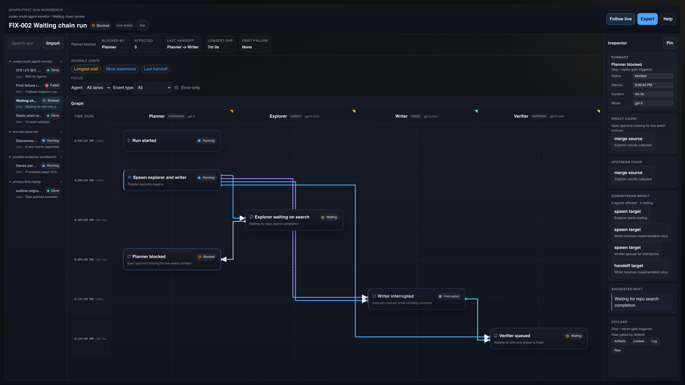
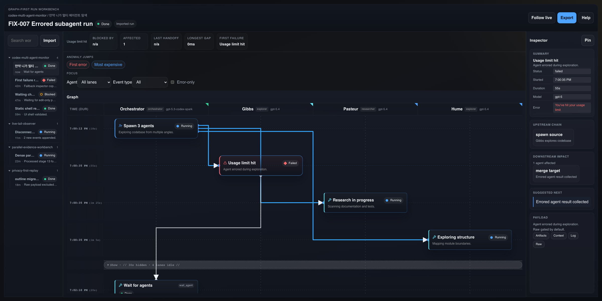
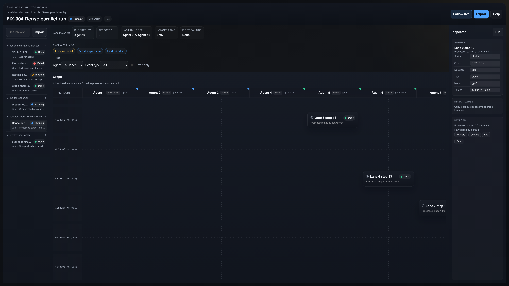
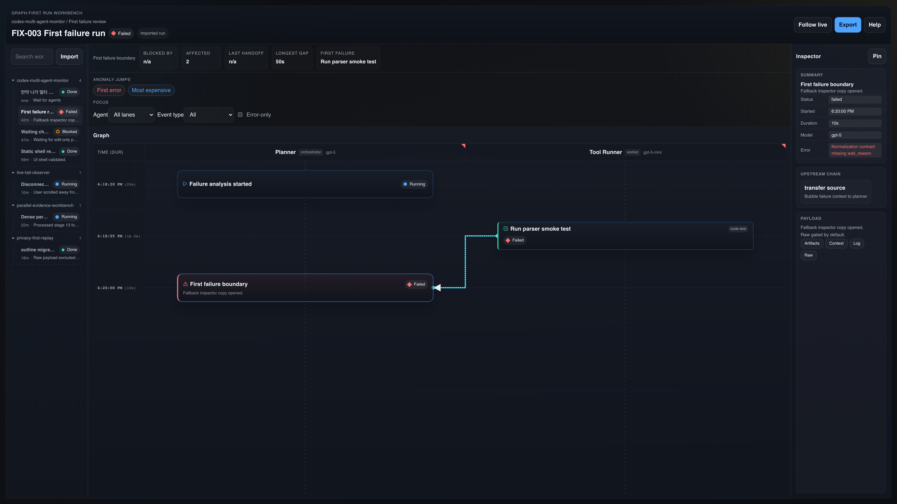
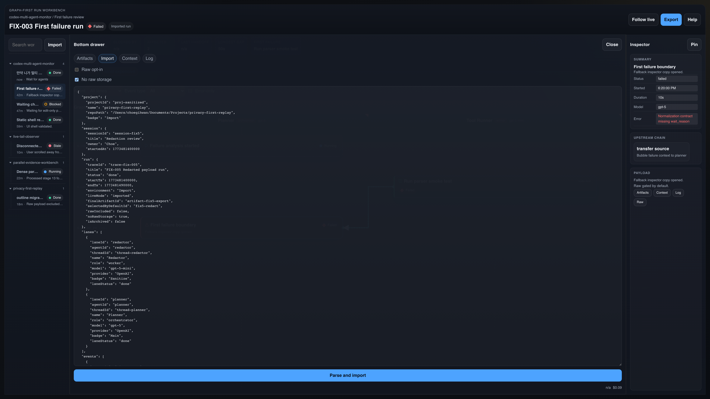
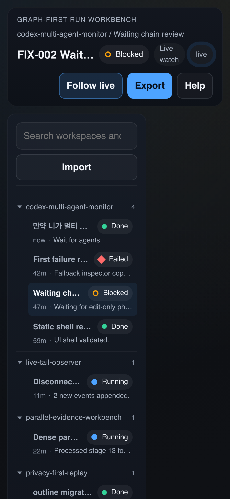

**English** | [한국어](README.ko.md)

<div align="center">

# Codex Multi-Agent Monitor

**Understand any multi-agent execution in 30 seconds — graph-first desktop debugging workbench**

[](https://v2.tauri.app)
[](https://react.dev)
[](https://www.rust-lang.org)
[](https://www.typescriptlang.org)
[](../../actions)
[](../../releases)

<br />

*"Five agents ran simultaneously — who did what and where did things get stuck?"*
*"Just open this tool."*

<br />



</div>

---

## Who is this for?

Running a multi-agent system means facing moments like these:

- "10 agents ran simultaneously... who delegated what to whom?"
- "Why was there a 30-second wait here?"
- "Found the failure point, but can't trace the flow leading up to it"
- "Don't want to scroll through 10,000 lines of logs"

Codex Multi-Agent Monitor turns this chaos into **a single causal graph**.

## Key Features

### Causal Graph

See spawn, handoff, transfer, and merge relationships between agents at a glance.
Failed paths in red, waiting nodes in yellow — your eye goes straight to the problem.



> *Orchestrator spawns 3 sub-agents, one of which (Gibbs) hits a usage limit. Pasteur and Hume continue normally. All visible in a single view.*

### Massive Parallel Execution

Whether you have 10 agents or 100, the lane-based layout organizes every concurrent execution clearly.



### Instant Error Detection

Jump to the first error point and trace the full path back to the failure.
One click on the "First error" jump button in the Summary strip is all it takes.



### JSON Import & Live Watch

Import completed execution records as JSON, or track live executions in real time.
Sensitive data is automatically masked, and raw data is stored only on an opt-in basis.



### Responsive Layout

From the 3-pane layout on desktop to a compact view on mobile.
The left rail and inspector panel are both drag-resizable.

<details>
<summary>View mobile layout</summary>
<br />
<div align="center">

</div>
</details>

## 30-Second Understanding Checklist

Open this tool and within 30 seconds you can answer:

| # | Question | Where to look |
|---|----------|---------------|
| 1 | How many agents ran? | Summary strip + lane headers |
| 2 | Who is running / waiting / done right now? | Status dot, node shape, Inspector |
| 3 | Where was the last handoff? | Anomaly jump bar |
| 4 | Where is the longest gap? | Gap chip + Summary metadata |
| 5 | If it failed, where was the first failure? | "First error" jump button |
| 6 | Who produced the final artifact? | Artifact chip + Inspector |

## Architecture

```
┌────────────────────────────────────────────────────┐
│                   Tauri 2 Shell                    │
│  ┌──────────────────────────────────────────────┐  │
│  │              React 19 Frontend               │  │
│  │                                              │  │
│  │  ┌─────────┐  ┌───────────┐  ┌───────────┐  │  │
│  │  │Run List │  │  Causal   │  │ Inspector │  │  │
│  │  │  Rail   │  │  Graph    │  │   Panel   │  │  │
│  │  │ (280px) │  │  Canvas   │  │  (360px)  │  │  │
│  │  └─────────┘  └───────────┘  └───────────┘  │  │
│  │                                              │  │
│  │  ┌──────────────────────────────────────────┐│  │
│  │  │     Bottom Drawer (Artifacts/Import)     ││  │
│  │  └──────────────────────────────────────────┘│  │
│  └──────────────────────────────────────────────┘  │
│                     IPC Bridge                     │
│  ┌──────────────────────────────────────────────┐  │
│  │              Rust Backend                    │  │
│  │         serde · serde_json · tauri           │  │
│  └──────────────────────────────────────────────┘  │
└────────────────────────────────────────────────────┘
```

### Domain Model

```
Project → Session → Run → Agent Lane → Event
                            ↕ Edge (spawn / handoff / transfer / merge)
                            → Artifact
```

| Status | Description | Color |
|--------|-------------|-------|
| `running` | In progress | Blue |
| `done` | Completed | Green |
| `waiting` | Waiting | Yellow |
| `blocked` | Blocked | Orange |
| `failed` | Failed | Red |
| `stale` | Inactive (5s+ no response) | Pink |
| `disconnected` | Disconnected (20s+) | Gray |

## Tech Stack

| Layer | Technology | Version |
|-------|------------|---------|
| **Desktop** | Tauri | 2 |
| **Frontend** | React | 19 |
| **Bundler** | Vite | 7 |
| **Language** | TypeScript (strict) | 5.8 |
| **Backend** | Rust | stable |
| **Icons** | lucide-react | 0.577 |
| **Linter** | Biome | 2.4 |
| **Unit Test** | Vitest | 4 |
| **E2E Test** | Playwright | 1.58 |
| **Component Docs** | Storybook | 10 |

## Getting Started

### Prerequisites

- [Node.js](https://nodejs.org/) >= 20.19
- [pnpm](https://pnpm.io/) 10+
- [Rust](https://www.rust-lang.org/tools/install) stable
- Tauri 2 [system dependencies](https://v2.tauri.app/start/prerequisites/)

### Install

```bash
git clone https://github.com/gihwan-dev/codex-multi-agents-monitor.git
cd codex-multi-agent-monitor
pnpm install
```

### Run

```bash
# Web dev server (Vite)
pnpm dev

# Tauri desktop app (Rust + React)
pnpm tauri:dev

# Production build
pnpm tauri:build
```

## Development

```bash
pnpm lint            # Biome lint
pnpm typecheck       # TypeScript type check
pnpm test            # Vitest unit tests
pnpm test:e2e        # Playwright E2E tests
pnpm storybook:build # Storybook build
pnpm build           # Production build
```

## Keyboard Shortcuts

| Key | Action |
|-----|--------|
| `/` | Focus search |
| `I` | Toggle Inspector |
| `.` | Toggle follow live |
| `E` | Error-only filter |
| `W` | Waterfall mode |
| `M` | Map mode |
| `Tab` | Navigate panels |
| `Arrow` | Navigate list / rows |
| `Esc` | Close drawer / menu |

## CI/CD

- **PR validation**: lint, typecheck, test, e2e, Rust check auto-run
- **Release**: `v*` tag push → macOS / Windows / Linux cross-build → GitHub Releases draft

```bash
# Release flow
node scripts/bump-version.mjs 0.2.0
git add -A && git commit -m "chore: bump version to 0.2.0"
git tag v0.2.0
git push origin main --tags
# → GitHub Actions cross-builds and creates a draft release
```

## Project Structure

```
src/
├── app/                    # App shell & state management
├── features/
│   ├── run-list/           # Workspace run tree (SCR-001)
│   ├── run-detail/         # Graph canvas & layout (SCR-002)
│   ├── inspector/          # Inspector panel (SCR-003)
│   ├── ingestion/          # Parser, normalizer, store
│   └── fixtures/           # Test fixtures (FIX-001~007)
├── shared/
│   ├── domain/             # Types, selectors, formatters
│   └── ui/                 # Panel, StatusChip, MetricPill, etc.
└── theme/                  # Design tokens (color, spacing, motion)

src-tauri/                  # Rust backend
tests/                      # Vitest + Playwright tests
docs/                       # Docs & screenshots
tasks/                      # Task bundles (PRD, UX Spec, Tech Spec)
```

## Roadmap

- [x] 3-Pane layout (Run List / Graph / Inspector)
- [x] Causal graph rendering (spawn, handoff, transfer, merge)
- [x] Summary strip & Anomaly jump bar
- [x] 7 test fixtures (normal/waiting/failed/parallel/masking/live/error)
- [x] JSON import & Bottom drawer
- [x] Responsive layout & mobile view
- [ ] Waterfall / Map renderer
- [ ] Live watch tail & reconnect
- [ ] Large-scale run virtualization
- [ ] Export feature

## Documentation

Detailed specifications and design documents are in the `tasks/codex-multi-agent-monitor-v0-1/` directory:

| Document | Contents |
|----------|----------|
| [PRD.md](tasks/codex-multi-agent-monitor-v0-1/PRD.md) | Product Requirements |
| [UX_SPEC.md](tasks/codex-multi-agent-monitor-v0-1/UX_SPEC.md) | UX Specification |
| [TECH_SPEC.md](tasks/codex-multi-agent-monitor-v0-1/TECH_SPEC.md) | Technical Specification |
| [ENGINEERING_RULES.md](docs/ai/ENGINEERING_RULES.md) | Stack, Architecture, Coding Rules |

## License

MIT
