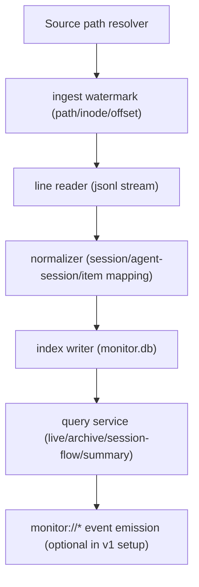
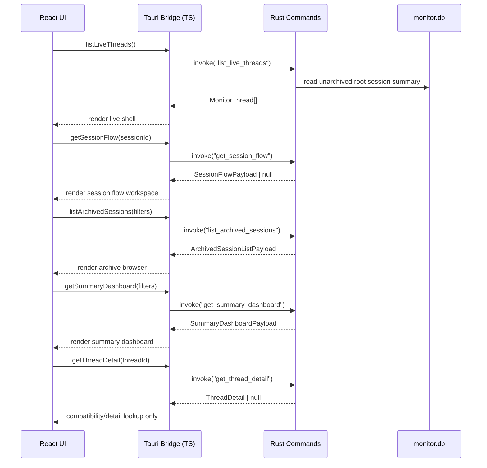

# Architecture (Session-First Baseline)

## Naming Baseline

- User-facing hierarchy: `Workspace > Chat(Session) > Agent Session > Item(Event)`
- UI copy: `챗` 또는 `세션`
- Public/shared contract naming: `session`
- Internal compatibility naming: `thread`, `thread_id`
- Storage/database naming은 현재 단계에서 유지하고, user-facing copy에 직접 노출하지 않는다.

## 1) 시스템 컨텍스트

```mermaid
flowchart LR
    U["사용자 (Desktop Operator)"] --> F["Frontend (React + TS)"]
    F -->|invoke/listen| B["Backend (Tauri + Rust)"]
    B -->|read-only| S["~/.codex/sessions/**/*.jsonl"]
    B -->|read-only| A["~/.codex/archived_sessions/*.jsonl"]
    B -->|read-only| M["~/.codex/state_5.sqlite"]
    B -->|read/write(app-owned)| D["monitor.db (app data dir)"]
```

## 2) Ingestion/Data Flow



## 3) Frontend-Backend Command/Event Boundary



## 모듈 경계 요약

- `src/shared/lib/tauri/*`: command/event 경계의 단일 진입점
- `src/shared/types/*`: session-first public/shared contract 정의
- `src-tauri/src/commands/*`: frontend가 호출 가능한 표면
- `src-tauri/src/state/*`: app-owned path (`monitor.db`)와 source path resolution
- `src-tauri/src/index_db/*`: app-owned SQLite 초기화/관리 책임
