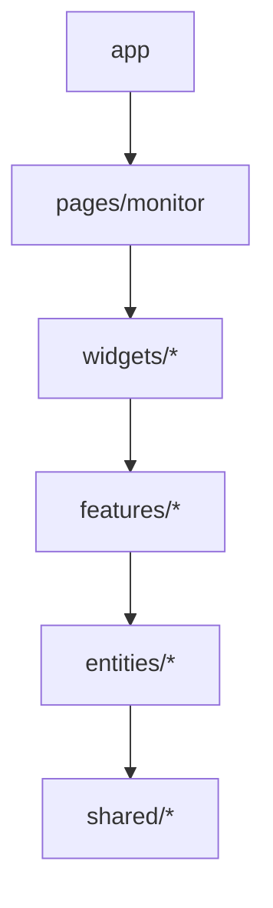
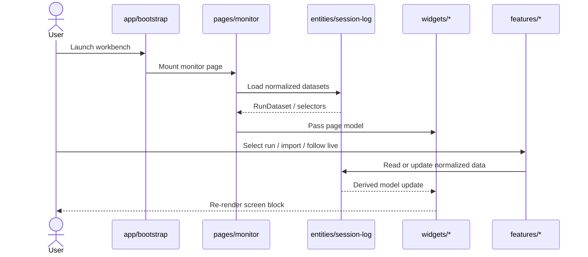

# FE FSD Boundary Note

이 문서는 현재 저장소의 프론트엔드 구조를 `app / pages / widgets / features / entities / shared` 6레이어 기준으로 정리한 아키텍처 기준 문서다. 목표는 화면 조합, 사용자 액션, 도메인 모델, 공용 유틸의 책임을 분리해 이전에 `src/app`와 `src/shared/domain`에 몰려 있던 결합도를 해소하는 것이다. `processes` 레이어는 v0.1 범위에 넣지 않는다. 모든 slice는 자기 public API만 노출하고, 상위 레이어는 하위 레이어의 `index.ts`를 통해서만 import한다.

## 1) 변경 배경
- 현재 구현은 `app`에 page orchestration이, `shared/domain`에 selector와 DTO가, `features/*`에 widget성 UI가 섞여 있어 경계가 흐리다.
- run list, graph, inspector, drawer는 사용자 액션보다 화면 블록 성격이 강해서 `widgets`로 분리하는 편이 유지보수에 유리하다.
- ingestion/import/watch 로직은 한 덩어리로 남기지 않고, 사용자 트리거는 `features`, 도메인 모델은 `entities`로 나눠야 한다.
- `shared/domain`을 permanent catch-all로 두면 다음 확장 때 다시 god module이 생기므로 해체를 전제로 문서를 맞춘다.

## 2) 변경 전/후 구조

### 변경 요약
- Before: `src/app`가 shell, state orchestration, loader, keyboard wiring, drawer/open-close, CSS까지 끌어안고 있었다.
- Before: `src/shared/domain`이 run/session/workspace DTO, selectors, summary model, inspector model을 한 번에 노출하고 있었다.
- Current: `app`는 bootstrap과 shell layout CSS만, `pages/monitor`는 page composition과 page-local orchestration, `widgets`는 화면 블록, `features`는 사용자 액션, `entities`는 핵심 모델, `shared`는 공용 primitive와 util만 담당한다.
- Current: `shared/domain`과 `app` 기반 loader shim은 제거됐다. 필요한 항목은 `entities/*`, `shared/api`, widget-local `model`로 정착했다.

### 구조 다이어그램

## 3) 주요 흐름
- `pages/monitor`가 active dataset, selection, live state, archive state를 모아 screen-level orchestration을 만든다.
- `widgets/run-tree`, `widgets/causal-graph`, `widgets/inspector`, `widgets/monitor-shell`, `widgets/bottom-drawer`가 페이지에서 받은 model을 렌더링한다.
- `features/archive-session`, `features/import-run`, `features/follow-live`, `features/workspace-identity`, `features/search-focus`가 사용자 의도를 액션으로 바꾼다.
- `entities/session-log`, `entities/run`, `entities/workspace`, `entities/archive-session`이 normalized data, selectors, DTO를 소유한다.
- `shared/ui`, `shared/lib`, `shared/testing`, `shared/theme`가 화면과 도메인에 공통인 토큰, primitive, helper, fixture를 제공한다.

### 시퀀스 다이어그램

## 4) 영향 범위
- 영향받는 레이어는 `src/app`, `src/pages`, `src/widgets`, `src/features`, `src/entities`, `src/shared`다.
- 호환성 shim은 두지 않는다. `shared/domain`과 `src/app/session-log-loader` 계열 경로는 이미 제거됐고 다시 만들지 않는다.
- 운영 리스크는 import churn과 selector 이동 중복이다. 이 때문에 한 slice마다 boundary family 하나만 옮기고 caller를 같이 갱신한다.

## 5) 운영 가드레일
- `src/app`에는 bootstrap과 `src/app/styles/layout.css`만 남긴다.
- `src/features/run-list`, `src/features/run-detail`, `src/features/inspector`, `src/shared/domain` 같은 삭제된 경로는 재도입하지 않는다.
- widget 스타일은 각 widget 옆 CSS에 두고, shell/grid 규칙만 `src/app/styles/layout.css`에 둔다.
- Tauri bridge 같은 공용 인프라는 `src/shared/api`에 둔다.

## 6) 기준 시점
- 문서 작성 시점: 2026-03-20
- 분석한 git 범위: `main` 워크트리 현재 상태
