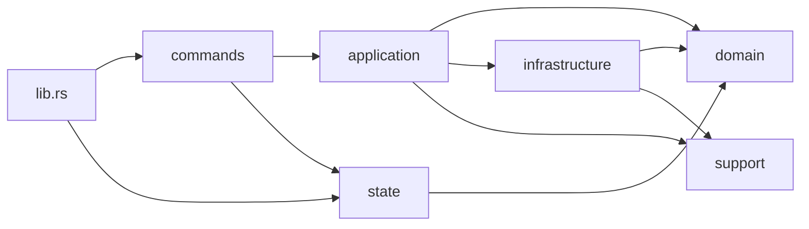

# Tauri Backend Modular Monolith

## Intent

이 앱의 Tauri backend는 별도 서버가 아니라 로컬 Codex session JSONL, SQLite state, git/worktree metadata를 읽어서 프런트 command에 응답하는 단일 프로세스 수집기다. 따라서 backend 경계는 microservice 분리가 아니라 `thin command adapter + modular monolith`를 기준으로 유지한다.

이번 리팩터링 이후 `src-tauri/src/lib.rs` 는 bootstrap only 파일이고, 실제 로직은 `commands / application / domain / infrastructure / state / support` 아래로 분리한다.

## Module Tree

```text
src-tauri/src/
  lib.rs
  commands/
    sessions.rs
    workspace.rs
  application/
    recent_sessions.rs
    archived_sessions.rs
    workspace_identity.rs
  domain/
    session.rs
    workspace.rs
    ingest_policy.rs
  infrastructure/
    session_jsonl.rs
    state_sqlite.rs
    git.rs
    filesystem.rs
  state/
    archive_cache.rs
  support/
    text.rs
    error.rs
  test_support.rs
```

## Dependency Direction



- `lib.rs`는 `mod` 선언, `manage(...)`, `generate_handler!`, `run()`만 가진다.
- `commands/*`는 `#[tauri::command]` adapter만 가진다.
- `application/*`는 use case orchestration과 policy 적용을 담당한다.
- `domain/*`는 프런트에 직렬화되는 DTO와 ingest/search/visibility 규칙을 소유한다.
- `infrastructure/*`는 filesystem, SQLite, JSONL, git/worktree 접근을 담당한다.
- `state/*`는 Tauri `State`로 관리되는 cache object만 가진다.
- `support/*`는 어느 한 도메인에 속하지 않는 leaf helper만 둔다.

## Command Contract

다음 command 이름과 인자/응답 shape는 frontend invoke 계약으로 고정한다.

- `resolve_workspace_identities`
- `load_recent_session_index`
- `load_recent_session_snapshot`
- `load_archived_session_index`
- `load_archived_session_snapshot`
- `refresh_archived_session_index`

다음 동작도 유지한다.

- recent index 로딩 실패 시 프런트 fallback 흐름이 깨지지 않는 반환 패턴 유지
- snapshot 로딩 실패 시 `null` 계열 반환 유지
- archived search는 trim 후 lowercase contains semantics 유지
- workspace identity lookup은 best-effort partial success 유지
- archived cache hit/miss와 refresh invalidation 상호작용 유지

## Boundary Rules

- command는 직접 filesystem, SQLite, git 접근을 하지 않는다.
- command는 `spawn_blocking`, `State` 추출, application 호출, 반환 shape 유지까지만 담당한다.
- application과 domain에는 Tauri 타입을 들이지 않는다.
- `ArchivedIndexCache` 같은 global mutable state는 `state/*`에만 두고 `lib.rs`에서만 `manage(...)` 한다.
- backend catch-all 파일인 `common.rs`, `utils.rs`, `shared.rs`를 새로 만들지 않는다.
- 신규 use case 로직을 `lib.rs`에 직접 추가하지 않는다.
- 테스트는 `lib.rs`에 몰아두지 않고 기능 모듈 인접 `#[cfg(test)]` 또는 `test_support.rs` 조합으로 유지한다.

## Validation

- backend 리팩터링 기본 검증: `cd src-tauri && cargo check`
- 경계 및 lint 검증: `cd src-tauri && cargo clippy -- -D warnings`
- 동작 회귀 검증: `cd src-tauri && cargo test`

프런트 contract 회귀는 저장소 루트에서 `pnpm typecheck`, `pnpm test`로 확인한다.
