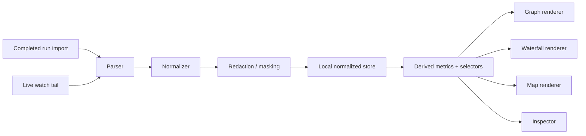
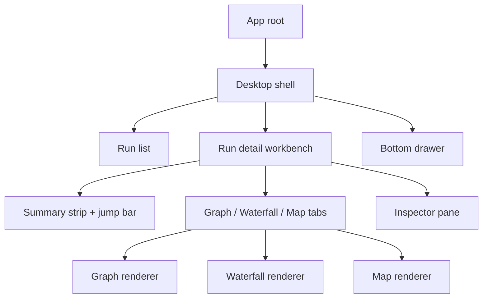

# Technical Specification

## Context and evidence

- 캡처 일시: `2026-03-14T10:20:05Z`
- 공식 개념 근거:
  - [Codex app](https://developers.openai.com/codex/app/)
  - [Multi-agents](https://developers.openai.com/codex/concepts/multi-agents/)
  - [Tracing - OpenAI Agents SDK](https://openai.github.io/openai-agents-python/tracing/)
  - [Overview | OpenTelemetry](https://opentelemetry.io/docs/specs/otel/overview/)
  - [Semantic conventions for OpenAI client operations | OpenTelemetry](https://opentelemetry.io/docs/specs/semconv/gen-ai/openai/)
  - [Handling sensitive data | OpenTelemetry](https://opentelemetry.io/docs/security/handling-sensitive-data/)
  - [Tracing Data Model in Langfuse](https://langfuse.com/docs/observability/data-model)

## Quality preflight

- verdict: `orchestrated-task`
- 현재 UI root는 `src/App.tsx` 11 LOC placeholder composition뿐이다.
- 현재 global style은 `src/styles.css` 74 LOC starter hero styling뿐이다.
- `src/main.tsx`는 bootstrap only entry이므로 안정 경계로 유지한다.
- `src-tauri/`는 runtime container지만 v0.1 shell/trace workbench 구현 초기에는 주 변경 대상이 아니다.
- 예상 post-change LOC는 append-only 기준 `src/App.tsx 250+`, `src/styles.css 400+`라서 starter 파일 유지 확장은 구조적으로 부적합하다.
- split-first: true. `src/App.tsx`와 `src/styles.css`에 append-only로 기능을 누적하지 않는다.

| Existing file | Current role | Post-change risk | Decision |
| --- | --- | --- | --- |
| `src/App.tsx` | placeholder root composition | app shell, selection state, renderer dispatch가 뒤섞일 위험 | root composition only 유지 |
| `src/styles.css` | starter palette + hero card | tokens, layout, state styles가 한 파일로 비대화 | theme tokens/layers로 분리 |
| `src/main.tsx` | app bootstrap | 낮음 | 그대로 유지 |

## Normalized trace domain model

- 핵심 entity는 `Project`, `Session`, `Run`, `AgentLane`, `Event`, `Edge`, `Artifact`다.
- tree hierarchy는 `Project -> Session -> Run -> AgentLane -> Event`다.
- link hierarchy는 `Edge`를 통해 `spawn`, `handoff`, `transfer`, `merge`를 추가 연결한다.
- `wait_reason`는 `waiting`, `blocked`, `interrupted` 상태에서 필수다.

| Entity | Required ids | Core fields |
| --- | --- | --- |
| `Project` | `project_id` | `name`, `repo_path`, `badge` |
| `Session` | `session_id` | `title`, `owner`, `started_at` |
| `Run` | `trace_id` | `status`, `start_ts`, `end_ts`, `duration_ms`, `summary_metrics` |
| `AgentLane` | `agent_id`, `thread_id` | `role`, `model`, `provider`, `lane_status` |
| `Event` | `event_id`, `parent_id`, `link_ids[]` | `event_type`, `status`, `wait_reason`, `retry_count`, `start_ts`, `end_ts`, `payload previews` |
| `Edge` | `edge_id` | `edge_type`, `source_agent_id`, `target_agent_id`, `source_event_id`, `target_event_id` |
| `Artifact` | `artifact_id` | `title`, `artifact_ref`, `producer_event_id`, `preview` |

- lifecycle status는 `queued -> running -> waiting | blocked | interrupted -> done | failed | cancelled`를 사용한다.
- v0.1 event type은 아래 집합으로 고정한다.
  - `run.started`
  - `run.finished`
  - `run.failed`
  - `run.cancelled`
  - `agent.spawned`
  - `agent.state_changed`
  - `agent.finished`
  - `llm.started`
  - `llm.finished`
  - `tool.started`
  - `tool.finished`
  - `handoff`
  - `transfer`
  - `error`
  - `note`

### Event field groups

- identity: `project_id`, `session_id`, `trace_id`, `event_id`, `agent_id`, `thread_id`, `parent_id`, `link_ids[]`
- time: `start_ts`, `end_ts`, `duration_ms`
- state: `event_type`, `status`, `wait_reason`, `retry_count`
- routing: `source_agent_id`, `target_agent_id`, `edge_type`
- model/tool: `provider`, `model`, `tool_name`, `api_type`
- usage: `tokens_in`, `tokens_out`, `cache_read_tokens`, `cache_write_tokens`, `cost_usd`, `finish_reason`
- payload: `title`, `input_preview`, `output_preview`, `artifact_ref`, `error_code`, `error_message`

## Derived metrics and selectors

- summary strip는 `total duration`, `active time`, `idle time`, `agent count`, `peak parallelism`, `llm calls`, `tool calls`, `tokens`, `cost`, `error count`를 계산한다.
- anomaly jump bar는 `first error`, `longest wait`, `most expensive step`, `last handoff`, `final artifact`를 selector로 계산한다.
- gap folding은 lane별 idle segment를 merge한 뒤 `hidden duration`, `idle lane count`, `expandable row index`로 보관한다.
- graph/waterfall/map는 공통 normalized dataset을 공유하고 renderer만 다르게 둔다.

## Ingestion and masking pipeline

- v0.1 입력 경로는 `completed-run import`, `live watch tail` 두 개뿐이다.
- source format은 JSONL 또는 custom event stream이어도 UI 진입 전에는 하나의 normalized schema로 바꾼다.
- redaction 단계는 parser 직후, persistence 이전에 실행한다.
- 기본 저장 정책:
  - preview만 저장
  - raw prompt/tool output은 opt-in
  - project 단위 `no raw storage` 스위치 제공
  - export는 raw 제외 default
- live watch는 reconnect tolerant 해야 하며 partial parse failure를 `error` event로 남긴다.

## Renderer boundaries and split-first file plan

- `src/app/`는 shell composition만 담당한다.
- `src/features/run-list/`는 `SCR-001`만 담당한다.
- `src/features/run-detail/graph/`, `src/features/run-detail/waterfall/`, `src/features/run-detail/map/`는 renderer별 view만 담당한다.
- `src/features/inspector/`는 selection summary와 payload tabs만 담당한다.
- `src/features/ingestion/`은 import/watch adapter, parser, normalizer, redactor를 담당한다.
- `src/features/fixtures/`는 `FIX-001` ~ `FIX-006` fixture source를 담당한다.
- `src/shared/domain/`은 types, ids, selectors, status helpers를 담당한다.
- `src/shared/ui/`는 primitive component와 tokenized CSS layer를 담당한다.

- target-file append 금지 규칙:
  - `src/App.tsx`는 composition만 유지한다.
  - `src/styles.css`는 starter 파일을 계속 확장하지 않는다.
  - parser/normalizer/storage/UI selector는 같은 파일에 같이 두지 않는다.

## Performance and degradation

- lane `> 8`, event `> 120`, repeated edge `> 40`, map node `> 20`에서 degradation 규칙을 활성화한다.
- graph hover highlight는 direct path 우선 계산 후 필요 시 확장한다.
- summary metrics는 renderer와 분리된 selector layer에서 계산해 mode toggle 비용을 줄인다.

## Privacy and operability

- sensitive payload는 preview-first, raw opt-in 원칙을 유지한다.
- inspector raw tab은 explicit permission 또는 import flag가 없으면 숨긴다.
- masking/redaction hook는 event 단위로 실행 가능해야 한다.
- operability summary는 stale/disconnected, parse error, missing fields, schema drift를 명시적으로 surface 해야 한다.

## Deferred scope

- cross-run comparison
- team analytics dashboard
- full diff viewer
- prompt playground
- sampling policy UI
