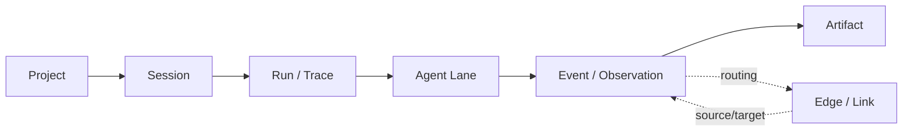

# UX Specification

## Goal/Audience/Platform

- Goal: `REQ-001`부터 `REQ-007`까지를 충족하는 graph-first 멀티에이전트 run 디버깅 워크벤치를 설계한다.
- Audience: 멀티에이전트 orchestration을 한 번에 읽어야 하는 제품 오너, 엔지니어, 리뷰어.
- Platform: Tauri desktop app 우선. 기본 타깃은 1280px 이상이지만 1024px 너비까지 버텨야 한다.
- Success impression: 대시보드가 아니라 차분하고 기술적인 관측 콘솔처럼 느껴져야 한다.

## 30-Second Understanding Checklist

- 사용자는 `몇 개 agent가 돌았는가`를 summary strip과 lane header만 보고 답할 수 있어야 한다.
- 사용자는 `지금 누가 running / waiting / done 인가`를 상태 점, node shape, inspector summary로 답할 수 있어야 한다.
- 사용자는 `마지막 handoff는 어디서 어디로 갔는가`를 anomaly jump 또는 latest handoff edge로 찾을 수 있어야 한다.
- 사용자는 `가장 긴 공백은 어디였는가`를 gap chip과 summary metadata로 찾을 수 있어야 한다.
- 사용자는 `실패했다면 첫 실패 지점은 어디인가`를 first error jump와 failed path highlight로 찾을 수 있어야 한다.
- 사용자는 `최종 산출물은 어느 agent가 만들었는가`를 final artifact chip과 inspector artifact reference로 말할 수 있어야 한다.
- Pass 기준: 위 여섯 질문의 답을 raw JSON 탭이나 full log 없이 `SCR-002`/`SCR-003`에서 찾을 수 있다.

## Visual Direction + Anti-goals

- Direction: `Warm Graphite Observatory`. 저채도 warm graphite surface 위에 상태 신호와 graph edge만 선명하게 뜨는 관측용 콘솔.
- Direction: `GitKraken graph grammar + Linear calm chrome + Langfuse/Sentry/Jaeger observability mental model`.
- Direction: dense list, sticky headers, tabular figures, subtle separators, minimal shadow, short motion.
- Direction: novelty보다 orientation 우선. navigation, work area, detail context가 첫 시선에 분리되어 보여야 한다.
- Anti-goal: KPI 카드가 주인공인 SaaS dashboard.
- Anti-goal: centered hero card, marketing panel, empty project를 살아 있는 run과 같은 무게로 보이게 하는 레이아웃.
- Anti-goal: 강한 glow, pure black 배경, lane 전체를 강한 색면으로 채우는 그래프.
- Anti-goal: raw payload를 기본으로 펼쳐 놓거나 모든 이벤트를 동일한 중요도로 노출하는 화면.

## Reference Pack (adopt/avoid)

- Adopt: [`DESIGN_REFERENCES/curated/gitkraken-graph-grammar-adopt.md`](DESIGN_REFERENCES/curated/gitkraken-graph-grammar-adopt.md) from [GitKraken Commit Graph](https://www.gitkraken.com/features/commit-graph). 세로 graph grammar와 `left panel -> graph -> detail` 읽기 흐름을 채택한다.
- Adopt: [`DESIGN_REFERENCES/curated/linear-calm-chrome-adopt.md`](DESIGN_REFERENCES/curated/linear-calm-chrome-adopt.md) from [A calmer interface for a product in motion](https://linear.app/now/behind-the-latest-design-refresh). dim sidebar, calm chrome, keyboard-first 분위기를 채택한다.
- Adopt: [`DESIGN_REFERENCES/curated/langfuse-timeline-adopt.md`](DESIGN_REFERENCES/curated/langfuse-timeline-adopt.md) from [Trace Timeline View](https://langfuse.com/changelog/2024-06-12-timeline-view). parallelism, bottleneck, timeline summary 관점을 채택한다.
- Adopt: [`DESIGN_REFERENCES/curated/langfuse-agent-graph-adopt.md`](DESIGN_REFERENCES/curated/langfuse-agent-graph-adopt.md) from [Agent Graphs](https://langfuse.com/docs/observability/features/agent-graphs). multi-agent interaction을 graph node/edge mental model로 읽는 방식을 채택한다.
- Avoid: [`DESIGN_REFERENCES/curated/starter-hero-avoid.md`](DESIGN_REFERENCES/curated/starter-hero-avoid.md) from current repo starter UI. 중앙 hero card와 marketing-like copy는 v0.1의 orientation 목적과 맞지 않는다.

## Glossary + Object Model

- `Project`: repo/workspace 단위 컨테이너. left rail 최상위 그룹.
- `Session`: 사용자의 하나의 작업 맥락. Run list와 breadcrumb에서 context label로 보인다.
- `Run`: 실제 실행 1회. 상세 workbench의 기본 단위.
- `Agent Lane`: 메인 agent 또는 sub-agent thread가 차지하는 lane. lane header에 이름, role, model, 상태가 붙는다.
- `Event`: 의미 있는 실행 단계. row 단위 노드.
- `Edge`: `spawn`, `handoff`, `transfer`, `merge`를 표현하는 link.
- `Artifact`: 최종 산출물, intermediate output, file ref, summary ref. inspector와 bottom drawer에서 연다.

- `Project -> Session -> Run -> Agent Lane -> Event`는 tree hierarchy다.
- `handoff`, `transfer`, `merge`는 parent-child만으로 표현하지 않고 `Edge`로 다시 연결한다.
- artifact는 event payload 일부가 아니라 별도 참조 가능한 object로 취급한다.

## Layout/App-shell Contract

- `SCR-001` Run Home은 left rail + main list 중심이다. Left rail은 `Running`, `Waiting`, `Recent`, `Empty` 그룹을 가진다.
- `SCR-002` Run Detail은 3-pane desktop shell을 사용한다.
- Top bar는 breadcrumb, run title, status pill, environment badge, live indicator, mode tabs, filters, search, export, command palette entry를 가진다.
- Main shell 기본 폭은 `left rail 280px`, `main canvas flexible`, `inspector 360px`로 시작하고 좌우 pane은 resize 가능해야 한다.
- Main canvas의 기본 모드는 `Graph`. Sticky event column은 280px~320px 범위에서 유지한다.
- Lane 하나는 agent thread 하나다. Lane header는 sticky이며 `agent name`, `role`, `model`, `thread/worktree badge`를 가진다.
- Optional bottom drawer는 artifact, log, diff, raw payload를 위해 존재하지만 기본은 닫힌 상태다.
- `SCR-003` Inspector는 `Summary`, `Input`, `Output`, `Trace`, `Raw` 탭을 가진다. `Summary`가 default다.

## Token + Primitive Contract

- Token source path candidate: `src/theme/tokens.css`, `src/theme/primitives.css`, `src/theme/motion.css`
- Primitive/component source: v0.1은 heavyweight UI library보다 custom thin layer를 우선한다. `Panel`, `StatusChip`, `MetricPill`, `LaneHeader`, `EventRow`, `GapChip`, `InspectorTabs`를 명시적으로 만든다.
- Typography: primary candidate는 `IBM Plex Sans`, metric/trace id는 `IBM Plex Mono`를 쓴다.
- Color tokens:
  - background `#0F1115`
  - panel `#141821`
  - surface `#1A1F2B`
  - text primary `#F3F6FB`
  - text secondary `#A6AFBD`
  - text tertiary `#737B88`
  - active `#4DA3FF`
  - success `#34D399`
  - waiting `#F5C451`
  - blocked `#F59E0B`
  - failed `#FF6B6B`
  - handoff `#A78BFA`
  - transfer `#67E8F9`
- Spacing token base는 `8px`, dense gap은 `4px`, panel padding은 `12px`, section padding은 `16px`.
- Radius token은 `panel 12`, `input 10`, `pill full`, selected row fill `8`.
- Motion은 short and meaningful만 허용한다. running pulse, lane highlight, drawer open 정도만 허용하고 perpetual ambient animation은 금지한다.

## Screen + Flow Coverage

- `SCR-001` Project / Run Home
  - 목적: 이상한 run을 10초 안에 찾기
  - 구성: project rail, grouped run list, status chips, dense metadata row
  - 소유 slice: `SLICE-1`, `SLICE-2`
- `SCR-002` Run Detail Workbench
  - 목적: 30초 체크리스트를 수행하기
  - 구성: summary strip, anomaly jump bar, mode tabs, sticky event column, graph/waterfall/map canvas
  - 소유 slice: `SLICE-1` ~ `SLICE-4`
- `SCR-003` Inspector + Bottom Drawer
  - 목적: 선택한 event/edge/artifact를 해부하기
  - 구성: tabbed inspector, payload preview, trace metadata, raw drawer
  - 소유 slice: `SLICE-1` ~ `SLICE-4`
- `FLOW-001` anomalous run 찾기: home list -> selected run -> detail transition
- `FLOW-002` graph에서 30초 체크리스트 수행: summary strip -> anomaly jump -> lane/event scan -> inspector confirm
- `FLOW-003` blocked/wait/handoff 조사: jump bar or filter -> edge click -> inspector summary
- `FLOW-004` completed run import: import action -> parse/normalize -> home list update -> detail open
- `FLOW-005` live watch follow: live badge -> auto-follow -> pause on manual navigation -> stale/reconnect handling
- `FLOW-006` alternate mode switch: graph <-> waterfall <-> map while preserving selected run and selected event context

## Implementation Prompt/Handoff

- `SLICE-1` reads `UX_SPEC.md` `30-Second Understanding Checklist`, `Layout/App-shell Contract`, `Token + Primitive Contract`, `Screen + Flow Coverage`, plus `UX_BEHAVIOR_ACCESSIBILITY.md` `Interaction Model`, `Accessibility Contract`, `Microcopy + Information Expression Rules`.
- `SLICE-2` reads `UX_BEHAVIOR_ACCESSIBILITY.md` `Keyboard + Focus Contract`, `Live Update Semantics`, `State Matrix + Fixture Strategy`, `Large-run Degradation Rules`, `Task-based Approval Criteria`.
- `SLICE-3` reads `TECH_SPEC.md` `Normalized trace domain model`, `Ingestion and masking pipeline`, `Derived metrics and selectors`, plus `PRD.md` `REQ-005`, `REQ-006`.
- `SLICE-4` reads `TECH_SPEC.md` `Live watch pipeline`, `Renderer boundaries`, `Performance and degradation`, plus `UX_BEHAVIOR_ACCESSIBILITY.md` `Live Update Semantics`, `Large-run Degradation Rules`, `Task-based Approval Criteria`.
