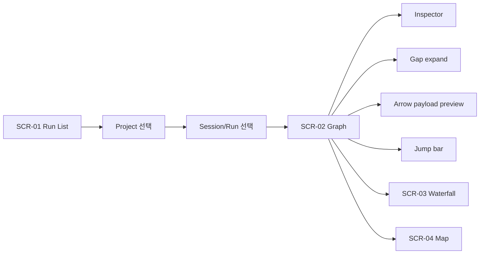

# Codex Multi-Agent Monitor v0.1 UX Spec

## Scope and source of truth

이 문서는 v0.1의 UX source of truth다. `SCR-*`, `FLOW-*`, `REQ-*` 기준으로 화면 구조, 상태 모델, interaction grammar를 고정한다.

## Information architecture

- `Project`: repo/workspace 단위의 최상위 탐색 entry
- `Session`: 사용자의 하나의 작업 맥락
- `Run`: 실제 실행 1회이자 상세 관찰의 기본 단위

## Screen inventory

- `SCR-01` Run List: 이상한 run을 빠르게 찾는 triage 화면
- `SCR-02` Run Detail / Graph: compressed event graph 중심 상세 화면
- `SCR-03` Run Detail / Waterfall: 실제 duration 중심 보조 화면
- `SCR-04` Run Detail / Map: macro dependency 보조 화면

## Global layout

- 좌측 rail: project, session, run 탐색
- 메인 canvas: Graph, Waterfall, Map 중 현재 모드 표시
- 우측 inspector: 선택된 event 또는 edge의 상세 정보
- 선택적 하단 drawer: artifact, raw JSON, diff, logs

## `SCR-01` Run List

### Goal

`REQ-01`을 만족시키기 위해 live, waiting/blocked, failed, recent completed run을 우선적으로 triage한다.

### Visible data

- 프로젝트명과 현재 선택 상태
- run 제목
- 현재 status
- 총 duration
- agent 수
- error 유무
- 마지막 업데이트 시각

### Interaction

- 프로젝트 row expand/collapse
- status 기반 정렬: live > waiting/blocked > failed > recent completed
- agent/event filter 상태가 있으면 badge로 유지

## `SCR-02` Run Detail / Graph

### Goal

`REQ-02`, `REQ-03`, `REQ-04`, `REQ-06`을 만족시키는 기본 읽기 모드다. 사용자는 이 화면만으로 causality, parallelism, waiting point를 이해할 수 있어야 한다.

### Structure

- top bar: breadcrumb, run title, status, environment badge, live indicator
- summary strip: `duration`, `active_time`, `idle_time`, `agent_count`, `peak_parallelism`, `llm_calls`, `tool_calls`, `total_tokens`, `total_cost`, `error_count`
- event column: sticky event label + metadata
- lane area: sticky header + event node + edge
- inspector: Summary, Input, Output, Trace, Raw 탭

### Graph grammar

- lane 하나 = agent thread 하나
- row 하나 = 의미 있는 event 하나
- `spawn`, `handoff`, `transfer`, `merge`를 edge로 표현
- idle gap은 `// 18m 24s hidden · 4 lanes idle //` 형식의 folded row로 표현

### Node states

- running: filled circle + subtle pulse
- waiting: hollow circle
- blocked: hollow circle + slash
- interrupted: hollow circle + pause style marker
- done: small solid circle
- failed: diamond
- tool: rounded square
- merge: double ring

### Edge states

- spawn: thicker solid curve
- handoff: violet smooth arrow
- transfer: thin dashed cyan arrow
- merge: converging curve

### Required interactions

- event type filter
- agent filter
- error only toggle
- gap fold/unfold
- arrow click payload preview
- jump bar: `First error`, `Longest wait`, `Most expensive step`, `Last handoff`, `Final artifact`
- keyboard: `Cmd/Ctrl+K`, `/`, `F`, `G`, `W`, `M`, `I`, `.`, `E`, `?`

## `SCR-03` Run Detail / Waterfall

### Goal

`REQ-05`의 latency lens다. 사용자는 실제 wall-clock 비율로 duration과 concurrency를 읽는다.

### Rules

- x축은 실제 시간
- y축은 lane
- event는 duration bar
- Graph와 동일한 filter와 inspector를 재사용

## `SCR-04` Run Detail / Map

### Goal

`REQ-05`의 macro dependency lens다. agent 간 handoff/transfer 빈도와 중심성을 읽는다.

### Rules

- node = agent
- edge = handoff/transfer
- node size = active time 또는 token cost
- edge thickness = interaction frequency

## State model

- `queued`
- `running`
- `waiting`
- `blocked`
- `interrupted`
- `done`
- `failed`
- `cancelled`

`REQ-03`에 따라 `waiting`, `blocked`, `interrupted`는 같은 정지 상태로 합치지 않는다. 세 상태 모두 inspector와 tooltip에서 `wait_reason`을 노출한다.

## View states

- empty: 추적된 run이 없음을 설명하고 import/watch/sample action 제공
- loading: project rail과 run detail에 skeleton
- live: live pill, follow live, last updated 표시
- waiting: amber accent, wait reason card
- failed: red accent, first error jump 우선
- completed: final artifact chip 강조

## Key flows

- `FLOW-01` Project 선택 -> Run 선택 -> Graph 기본 진입
- `FLOW-02` Graph에서 특정 event/edge 선택 -> Inspector 열기
- `FLOW-03` Jump bar에서 `Longest wait` 선택 -> 해당 row scroll/focus
- `FLOW-04` Graph <-> Waterfall <-> Map 전환
- `FLOW-05` Arrow payload preview -> transfer/handoff 요약 확인

## Visual direction

- 테마: Warm Graphite Observatory
- chrome은 low-chroma, state signal만 고채도 사용
- lane 전체를 진한 배경색으로 칠하지 않고 subtle tint만 사용
- 숫자는 tabular figure 우선

## Traceability map

- `SCR-01` -> `REQ-01`
- `SCR-02` -> `REQ-02`, `REQ-03`, `REQ-04`, `REQ-06`
- `SCR-03` -> `REQ-05`
- `SCR-04` -> `REQ-05`
- `FLOW-01`~`FLOW-05` -> `AC-01`~`AC-06`
