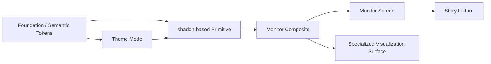

# UX Specification

## Goal/Audience/Platform

- Goal: `REQ-001`부터 `REQ-006`까지를 충족하도록 monitor를 Tailwind CSS v4 + shadcn/ui 기반 디자인 시스템으로 전환한다.
- Audience: Storybook으로 design feedback loop를 운영하는 maintainer와, 멀티에이전트 run을 빠르게 읽어야 하는 엔지니어/리뷰어.
- Platform: Tauri desktop app 우선. Storybook은 component review와 visual regression의 기준 surface다.
- Success impression: generic SaaS dashboard가 아니라 조용하고 정돈된 operator console처럼 느껴져야 한다.

## 30-Second Understanding Checklist

- 사용자는 migrated chrome과 graph shell만 보고 `몇 개 agent가 돌았는가`를 summary strip과 lane header에서 답할 수 있어야 한다.
- 사용자는 `지금 누가 running / waiting / done 인가`를 status chip, lane emphasis, inspector summary에서 답할 수 있어야 한다.
- 사용자는 `마지막 handoff는 어디서 어디로 갔는가`를 jump control과 graph selection에서 찾을 수 있어야 한다.
- 사용자는 `가장 긴 공백은 어디였는가`를 gap treatment와 summary metadata에서 찾을 수 있어야 한다.
- 사용자는 `실패했다면 첫 실패 지점은 어디인가`를 first-error focus affordance로 찾을 수 있어야 한다.
- 사용자는 `최종 산출물은 어느 agent가 만들었는가`를 drawer/inspector artifact summary로 말할 수 있어야 한다.
- Pass 기준: 위 여섯 질문의 답이 design-system migration 이후에도 `SCR-003`에서 raw payload 없이 유지된다.

## Visual Direction + Anti-goals

- Direction: `Reuse + delta`. existing warm graphite tone, IBM Plex Sans/Mono, three-pane shell, graph-first reading order는 유지하고 primitive language만 shadcn 기반으로 재구성한다.
- Direction: `Calm desktop chrome`. border, spacing, radius, elevation은 절제하고 정보 계층이 먼저 보이게 한다.
- Direction: `Semantic status system`. running, waiting, blocked, failed, handoff, transfer는 palette와 iconography가 함께 의미를 전달해야 한다.
- Direction: `Composable review loop`. component 수준에서 먼저 승인받고 screen 수준으로 올리는 흐름이 Storybook IA에 드러나야 한다.
- Anti-goal: default shadcn demo look, round-heavy consumer SaaS aesthetic, glossy marketing panel.
- Anti-goal: 기존 graph-first shell을 지우고 흰 카드/큰 gap 위주의 generic dashboard로 회귀하는 것.
- Anti-goal: Tailwind utility와 legacy CSS selector가 둘 다 source of truth가 되는 이중 체계.
- Anti-goal: primitive 승인 없이 MonitorPage 전체를 한 번에 갈아엎는 giant rewrite.

## Reference Pack (adopt/avoid)

- Adopt: [`DESIGN_REFERENCES/curated/current-ui-shell-reuse-delta.md`](DESIGN_REFERENCES/curated/current-ui-shell-reuse-delta.md) from current repo shell audit. three-pane workbench, warm graphite, dense operator feel을 `reuse + delta` 기준으로 유지한다.
- Adopt: [`DESIGN_REFERENCES/curated/gitkraken-graph-grammar-adopt.md`](DESIGN_REFERENCES/curated/gitkraken-graph-grammar-adopt.md) from [GitKraken Commit Graph](https://www.gitkraken.com/features/commit-graph). dense relation grammar와 좌측 탐색 -> 중심 작업면 -> 우측 detail 흐름을 채택한다.
- Adopt: [`DESIGN_REFERENCES/curated/linear-calm-chrome-adopt.md`](DESIGN_REFERENCES/curated/linear-calm-chrome-adopt.md) from [A calmer interface for a product in motion](https://linear.app/now/behind-the-latest-design-refresh). calm chrome, compact toolbar, restrained surface hierarchy를 채택한다.
- Adopt: [`DESIGN_REFERENCES/curated/langfuse-density-adopt.md`](DESIGN_REFERENCES/curated/langfuse-density-adopt.md) from [Trace Timeline View](https://langfuse.com/changelog/2024-06-12-timeline-view). dense observability rhythm과 bottleneck scanning 관점을 채택한다.
- Avoid: [`DESIGN_REFERENCES/curated/current-style-system-avoid.md`](DESIGN_REFERENCES/curated/current-style-system-avoid.md) from current repo style audit. monolithic `primitives.css`와 widget-local CSS accumulation은 회피 기준으로 고정한다.

## Glossary + Object Model

- `Foundation token`: typography, spacing, radius, elevation, neutral surface scale.
- `Monitor semantic token`: run status, handoff, transfer, failure, stale, graph emphasis처럼 제품 의미가 실린 token.
- `Primitive`: shadcn open-code 기반의 generic UI building block. 예: `Button`, `Card`, `Tabs`, `Sheet`.
- `Monitor composite`: primitive를 monitor semantics에 맞게 감싼 repo-local component. 예: `StatusChip`, `MetricPill`, `InspectorTabs`.
- `Specialized visualization surface`: graph, timeline, gap detail처럼 generic primitive로 대체되지 않는 dense surface.
- `Story fixture`: deterministic component/screen state for review, a11y, regression.
- `Theme mode`: `dark`, `light`, `system` 세 축. 이 task는 theme-ready 구조와 preview까지를 기본 범위로 본다.

- `Foundation token -> Primitive -> Monitor composite -> Screen`이 기본 조립선이다.
- graph/timeline은 primitive 위에 얹히는 screen-specific surface지만 token과 composite contract를 공유한다.
- Storybook fixture는 primitive와 screen 양쪽에 공통으로 붙어야 한다.

## Layout/App-shell Contract

- `SCR-001` Storybook IA는 `Foundations`, `Primitives`, `Monitor Composites`, `Screens` 네 그룹으로 보인다.
- `SCR-002` Monitor shell은 현재와 같은 `left rail -> main workbench -> inspector` 3-pane desktop shell을 유지한다.
- left rail, summary strip, graph toolbar, inspector tabs, drawer header처럼 generic UI와 monitor semantics가 섞이는 chrome부터 디자인 시스템 적용을 시작한다.
- graph canvas와 gap detail은 shell/chrome는 디자인 시스템으로 정리하되, rendering grammar는 custom surface로 유지한다.
- 기본 폭 계약은 기존 UX와 동일하게 `left rail 280px`, `main flexible`, `inspector 360px`를 시작점으로 둔다.
- theme preview는 Storybook과 app shell 모두에서 확인 가능해야 하지만, user-facing toggle placement 자체는 follow-up issue `#5`에서 확정한다.

## Token + Primitive Contract

- semantic token source of truth는 CSS custom properties다. 기본 위치는 `src/theme/tokens.css`, motion은 `src/theme/motion.css`를 유지한다.
- Tailwind CSS v4는 새 entry CSS에서 `@import "tailwindcss"`와 `@theme inline`으로 semantic token을 utility world로 매핑한다.
- `src/theme/primitives.css`는 migration bridge이며 deletion target이다. end state에서는 reset과 primitive presentation 책임을 가지지 않는다.
- shadcn open-code primitives는 `src/shared/ui/primitives/` 아래로, monitor-specific wrappers는 `src/shared/ui/monitor/` 아래로 재배치하는 방향을 기본안으로 둔다.
- 초기 primitive 후보: `Button`, `Input`, `Textarea`, `Tabs`, `Badge`, `Card`, `Separator`, `Tooltip`, `Dialog`, `Sheet`, `DropdownMenu`, `Command`, `ScrollArea`, `Skeleton`.
- 초기 monitor composite 후보: `StatusChip`, `MetricPill`, `InspectorTabs`, `ToolbarButton`, `FilterChip`, `PanelSection`.
- typography는 `IBM Plex Sans`와 `IBM Plex Mono`를 유지한다.
- 새 UI 변경은 utility classes + variant helpers로만 표현하고, 새 widget CSS 파일 추가는 허용하지 않는다.

## Screen + Flow Coverage

- `SCR-001` Storybook Foundations
  - 목적: token, typography, spacing, status palette, dark/light preview를 승인한다.
  - 소유 slice: `SLICE-1`, `SLICE-2`
- `SCR-002` Storybook Primitives + Monitor Composites
  - 목적: base primitive와 monitor wrapper를 fixture 기반으로 승인한다.
  - 소유 slice: `SLICE-2`, `SLICE-3`
- `SCR-003` Migrated Monitor Workbench
  - 목적: 실제 app에서 30-second checklist를 유지한 채 migrated surfaces를 검증한다.
  - 소유 slice: `SLICE-3` ~ `SLICE-6`
- `FLOW-001` primitive review loop: issue scope 확인 -> story 작성 -> 피드백 -> variant 조정 -> 승인
- `FLOW-002` component adoption: approved primitive/composite -> real monitor surface 교체 -> screen regression 확인
- `FLOW-003` theme-ready preview: dark baseline -> light preview -> semantic token parity 확인
- `FLOW-004` CSS retirement audit: migrated screen 확인 -> legacy selector 제거 -> build/storybook smoke -> rollback checkpoint 저장

## Implementation Prompt/Handoff

- `SLICE-1`은 `30-Second Understanding Checklist`, `Layout/App-shell Contract`, `Token + Primitive Contract`, `Screen + Flow Coverage`를 읽고 foundation을 깐다.
- `SLICE-2`는 `UX_BEHAVIOR_ACCESSIBILITY.md`의 `Interaction Model`, `Keyboard + Focus Contract`, `Accessibility Contract`, `State Matrix + Fixture Strategy`, `Task-based Approval Criteria`를 읽고 story coverage를 고정한다.
- `SLICE-3+`는 `TECH_SPEC.md`, `MIGRATION.md`, `VERIFICATION.md`를 읽고 실제 monitor surface migration과 CSS retirement를 수행한다.
- implementation 중 issue `#5` 범위가 이 task로 다시 들어오면 `Token + Primitive Contract`, `Live Update Semantics`, `MIGRATION.md`의 phase split을 먼저 재조정한다.
