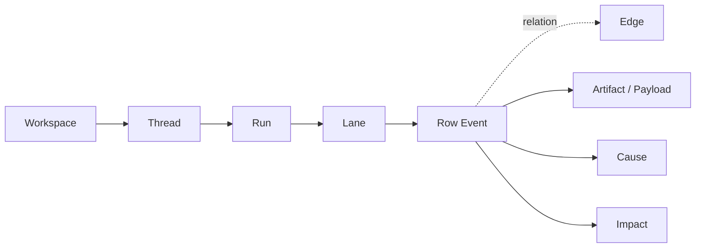

# UX Specification

## Goal/Audience/Platform

- Goal: `REQ-001`부터 `REQ-005`까지를 만족하도록 현재 monitor UI를 workspace-grouped observability workbench로 재설계한다.
- Audience: 멀티에이전트 run의 block, handoff, failure, artifact 흐름을 빠르게 읽어야 하는 엔지니어, 제품 오너, 리뷰어.
- Platform: Tauri desktop app 우선. 기본 타깃은 1280px 이상이며 1024px까지는 정보 구조가 무너지지 않아야 한다.
- Success impression: 대시보드가 아니라 dense한 desktop observability workspace처럼 느껴져야 한다.

## 30-Second Understanding Checklist

- 사용자는 `지금 어느 workspace / thread / run을 보고 있는가`를 top bar와 left rail만 보고 답할 수 있어야 한다.
- 사용자는 `현재 어디가 waiting / blocked / failed 인가`를 quick filters, selected row, inspector summary로 답할 수 있어야 한다.
- 사용자는 `마지막 handoff가 어디서 누구에게 갔는가`를 anomaly chip 또는 selected path에서 즉시 찾을 수 있어야 한다.
- 사용자는 `가장 긴 공백과 실제 병목 지점이 어디인가`를 gap row와 time gutter, compact summary로 파악할 수 있어야 한다.
- 사용자는 `선택된 이벤트의 원인과 영향이 무엇인가`를 inspector의 Cause / Impact 영역에서 말할 수 있어야 한다.
- 사용자는 `지금 필요한 artifact나 payload를 보기 위해 drawer를 열어야 하는가`를 graph/inspector affordance만 보고 판단할 수 있어야 한다.
- Pass 기준: 위 여섯 질문의 답을 `SCR-001`, `SCR-002`, `SCR-003` 안에서 raw payload 전체 열람 없이 찾을 수 있다.

## Visual Direction + Anti-goals

- Reuse + delta: 기존 warm graphite palette, IBM Plex Sans/Mono, thin primitive layer, 3-pane shell은 유지하고, status-card rail, stacked empty panels, board-like graph grammar는 제거한다.
- Direction: `Observability Workbench, Not Dashboard`. 정보량은 높되 읽기 순서는 명확해야 한다.
- Direction: calm chrome, low-noise surface, tight spacing, sticky headers, tabular precision.
- Direction: row-first trace grammar. 카드보다 행과 연결이 먼저 보이게 한다.
- Direction: selected path와 상태 의미만 강하게 강조하고, 나머지는 dim 처리한다.
- Anti-goal: `Running / Waiting / Recent`가 좌측 탐색의 최상위 구조가 되는 상태 중심 내비게이션.
- Anti-goal: summary, anomaly, filters, graph, drawer가 모두 같은 무게의 박스로 쌓이는 panel wall.
- Anti-goal: large event cards와 detached edge pills 때문에 graph가 kanban board처럼 보이는 화면.
- Anti-goal: 닫힌 drawer나 비어 있는 panel이 graph 영역을 계속 잠식하는 레이아웃.

## Reference Pack (adopt/avoid)

- Adopt: [`DESIGN_REFERENCES/curated/gitkraken-graph-grammar-adopt.md`](DESIGN_REFERENCES/curated/gitkraken-graph-grammar-adopt.md) from [GitKraken Commit Graph](https://www.gitkraken.com/features/commit-graph). 세로 읽기 흐름, sticky-like contextual graph reading, relation-first grammar를 채택한다.
- Adopt: [`DESIGN_REFERENCES/curated/linear-calm-chrome-adopt.md`](DESIGN_REFERENCES/curated/linear-calm-chrome-adopt.md) from [A calmer interface for a product in motion](https://linear.app/now/behind-the-latest-design-refresh). calm chrome, restrained borders, dense sidebar tone을 채택한다.
- Adopt: [`DESIGN_REFERENCES/curated/langfuse-timeline-density-adopt.md`](DESIGN_REFERENCES/curated/langfuse-timeline-density-adopt.md) from [Trace Timeline View](https://langfuse.com/changelog/2024-06-12-timeline-view). timeline mental model, bottleneck scanning, dense trace reading을 채택한다.
- Avoid: [`DESIGN_REFERENCES/curated/current-dashboard-shell-avoid.md`](DESIGN_REFERENCES/curated/current-dashboard-shell-avoid.md) from current repo implementation review. status-grouped run cards, stacked panels, board-like graph shell은 이번 redesign의 회피 기준이다.

## Glossary + Object Model

- `Workspace`: repo/project 맥락. left rail 최상위 그룹.
- `Thread`: workspace 아래의 작업 문맥. session 또는 task theme를 묶는 UI label.
- `Run`: 실제 실행 1회. 상세 workbench의 기준 단위.
- `Lane`: agent 또는 sub-agent column.
- `Row Event`: time gutter에 정렬되는 의미 있는 실행 이벤트 1개.
- `Edge`: `spawn`, `handoff`, `transfer`, `merge`를 나타내는 연결.
- `Selection path`: 선택된 row/edge를 기준으로 강조되는 causal chain.
- `Cause`: 선택된 항목을 만들거나 막은 직접 원인.
- `Impact`: 선택된 항목 이후에 영향을 받은 downstream row, edge, artifact.
- `Drawer content`: artifact, log, raw payload처럼 필요 시만 열리는 secondary detail.

- UI tree는 `Workspace -> Thread -> Run`이고, detail canvas는 `Lane -> Row Event`를 중심으로 읽는다.
- domain model의 `Project`와 `Session`은 UI에서 각각 `Workspace`와 `Thread` 언어로 번역해 사용한다.
- causal information은 row payload 안에 숨기지 않고 selection path와 inspector section으로 다시 표현한다.

## Layout/App-shell Contract

- `SCR-001` Left rail은 `search/import/live actions`, `quick filters`, `workspace tree`, `dense run rows`를 가진다.
- quick filters는 `All`, `Live`, `Waiting`, `Failed` 수준의 간단한 chip row로 유지하고 workspace tree보다 시각적으로 강하지 않아야 한다.
- workspace row는 폴더 아이콘, 이름, run count, expand state만 가진다. card styling을 금지한다.
- run row는 상태 dot, title 1줄, subline 1줄, relative time 1개 정도만 가진 dense row여야 한다.
- `SCR-002` top bar는 workspace breadcrumb, run title, status/live badges, quick actions를 가진 compact header다. H1은 현재보다 작아야 한다.
- summary, anomaly jumps, filters, mode tabs는 graph 위에서 두 줄을 넘기지 않는 `compact summary strip + graph toolbar`로 압축한다.
- graph header는 sticky lane header와 함께 동작해야 하며 `Graph`, `Waterfall`, `Map` mode switch는 toolbar 안에 들어간다.
- primary graph는 `time gutter + lanes + rows + edges + gap rows` 구조를 가진다. lane card grid를 금지한다.
- selected row 또는 selected edge는 graph 안에서 causal path를 강조하고 inspector에서 같은 path를 재설명해야 한다.
- `SCR-003` inspector는 `Summary`, `Cause`, `Impact`, `Payload` section을 가진다. raw payload는 drawer 또는 gated tab로만 노출한다.
- bottom drawer는 기본 높이 0이며 artifact/log/raw action이 있을 때만 나타난다.
- 기본 desktop 폭 가이드는 `left rail 260px`, `main flexible`, `inspector 340px`다. 1024px 근처에서는 inspector 또는 drawer가 더 공격적으로 접힐 수 있다.

## Token + Primitive Contract

- Token source path는 계속 `src/theme/tokens.css`, `src/theme/primitives.css`, `src/theme/motion.css`를 사용한다.
- Primitive/component source는 계속 repo-local thin layer를 사용한다. 이번 task의 신규 후보는 `WorkspaceTree`, `RunRow`, `ControlStrip`, `GraphToolbar`, `TimelineGutter`, `GraphEventRow`, `InspectorSection`, `ContextJump`다.
- Typography는 기존 `IBM Plex Sans` + `IBM Plex Mono` 방향을 유지한다.
- Surface rule: 1차 surface는 app shell, 2차 surface는 graph/inspector, 3차 emphasis만 chip/button에 허용한다. panel inside panel inside panel 구조를 금지한다.
- Border rule: 강한 border보다 subtle separator를 우선하고, radius는 panel 12 이하, row 8 이하로 제한한다.
- Density rule: list row vertical padding은 8px 안팎, section gap은 12px 안팎, toolbar chip은 compact size를 유지한다.
- Status color는 의미 강조에만 쓰고 전체 panel 배경이나 lane 배경을 칠하지 않는다.
- Motion은 selection highlight, drawer reveal, live pulse 정도만 허용한다. perpetual ambient animation은 금지한다.

## Screen + Flow Coverage

- `SCR-001` Workspace Tree Home
  - 목적: 적절한 run을 10초 안에 찾기
  - 구성: quick filters, workspace tree, dense run rows, relative activity context
  - 소유 slice: `SLICE-1`, `SLICE-2`
- `SCR-002` Run Detail Workbench
  - 목적: 30초 체크리스트를 graph 중심으로 수행하기
  - 구성: compact summary strip, graph toolbar, row-based event graph, sticky lane headers, gap rows
  - 소유 slice: `SLICE-1`, `SLICE-3`, `SLICE-5`
- `SCR-003` Inspector + Drawer
  - 목적: 선택된 항목의 원인과 영향을 해부하고 필요할 때만 secondary detail 열기
  - 구성: Summary/Cause/Impact/Payload sections, contextual jumps, on-demand drawer
  - 소유 slice: `SLICE-1`, `SLICE-4`, `SLICE-5`
- `FLOW-001` anomalous run 찾기: quick filter -> workspace expand -> run row select
- `FLOW-002` 30초 스캔: compact strip -> anomaly chip -> selected row -> inspector confirm
- `FLOW-003` blocked/handoff/failure 조사: row or edge select -> selected path highlight -> inspector Cause/Impact
- `FLOW-004` artifact/log/raw 열기: inspector or row affordance -> drawer open -> focus return
- `FLOW-005` mode 전환: graph <-> waterfall <-> map while preserving run selection and current context

## Implementation Prompt/Handoff

- `SLICE-1`은 `30-Second Understanding Checklist`, `Layout/App-shell Contract`, `Token + Primitive Contract`, `Screen + Flow Coverage`를 읽고 static shell을 먼저 재구성한다.
- `SLICE-2`는 `UX_BEHAVIOR_ACCESSIBILITY.md`의 `Interaction Model`, `Keyboard + Focus Contract`, `State Matrix + Fixture Strategy`를 읽고 workspace tree와 local interaction을 연결한다.
- `SLICE-3`은 `SCR-002`, `FLOW-002`, `FLOW-003` 계약을 기준으로 row-based graph와 selected-path data flow를 연결한다.
- `SLICE-4`는 `SCR-003`, `FLOW-003`, `FLOW-004` 계약을 기준으로 inspector cause/impact와 drawer reveal rule을 구현한다.
- `SLICE-5`는 `FLOW-005`, `Large-run Degradation Rules`, `Task-based Approval Criteria`를 기준으로 alternate view alignment와 regression verification을 닫는다.
